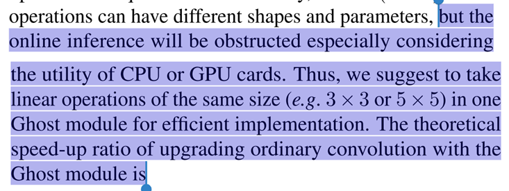
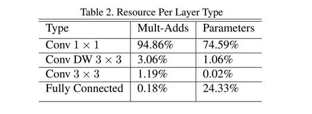
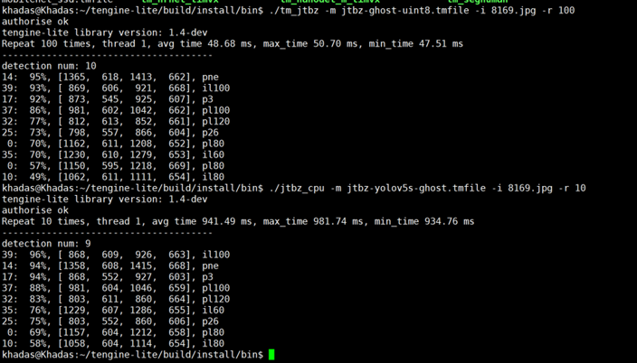

# yolov5s-jtbz-npu
复现在KhadasVIM3上使用tengine部署yolov5s的交通标志识别模型到NPU上，单张图片平均推理时间49.83ms

需要的前置知识包括：

1. 在x86下编译Tengine的模型转换工具和量化工具，知道对应参数怎么设置。
2. 在KhadasVim3上的编译
3. 常用的Linux指令，CmakeList怎么用

仓库里面主要就是我对这个项目的一个简单实现，只包括了相关的模型，代码，需要自己根据实际情况来编译使用。

### 	使用ghostNet也是同样的过程（可以使用同样的代码）

**但是GhostNet论文也说到了，它主要是加速cpu计算，我在实现NPU的情况并没有很大的提升，但是在KhadasVim3的CPU上，有良好的表现效果。**

